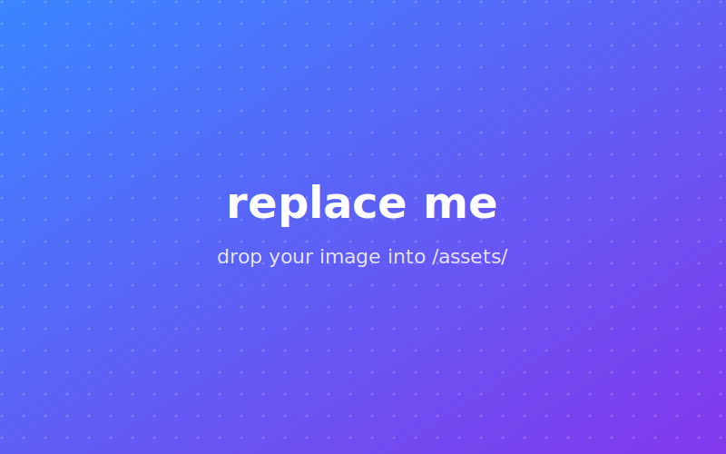

---

## How this deck is authored

- Each slide is a Markdown block separated by `---` on its own line.
- Use `--` on its own line to create vertical sub-slides.
- Anything after `Note:` on a line becomes speaker notes.

Edit `slides.md` and the page reloads automatically.

---

## Markdown that just works

- **Bold**, *italic*, ~~strike~~, `inline code`
- Bulleted and numbered lists
- [Links](https://revealjs.com/markdown/) keep their formatting
- Images: ``

<small class="source">Reference: revealjs.com/markdown</small>

---

## Reveal one bullet at a time

- This appears first <!-- .element: class="fragment" -->
- Then this <!-- .element: class="fragment" -->
- Finally this <!-- .element: class="fragment" -->

Note:
Press `Space` / `→` to advance fragments, `←` to go back.

---

## Code, with syntax highlighting

```js [1-3|5-7]
function dontPanic(year) {
  return year < 2030 ? "we'll be fine" : "still fine";
}

// line-numbers and step-through highlighting
// are driven by the [1-3|5-7] above
console.log(dontPanic(2026));
```

---

## Vertical slides for drill-downs

Press `↓` to go deeper into a topic, `→` to skip it.

--

### Drill-down: evidence

- Polish IT job market: post-COVID all-time high
- US IT job market: same trend
- BPOs: hiring up, not down

--

### Drill-down: the Jevons paradox

Cheaper compute → more compute used, not less.
The same applies to engineering output.

---

## Quotes look great too

> "American programmers will share the fate of the dodo bird."

<small class="source">Ed Yourdon, 1992 — and yet, here we are.</small>

---

<!-- .slide: data-background-color="#1a1a2e" -->

## Custom backgrounds per slide

Add `<!-- .slide: data-background-color="#hex" -->` at the top of any slide,
or use `data-background-image`, `data-background-video`, etc.

---

## Sizing a single image


<!-- .element: style="max-height: 50vh" -->

The `<!-- .element: ... -->` comment after any markdown element
attaches HTML attributes to it — `style`, `class`, `width`, anything.

---

## Image beside text

<div class="cols image-text">
  <div>


  </div>
  <div>

### The trimodal market

- Three pay tiers, not one curve
- The top tier keeps growing fastest
- AI tooling widens the gap further

  </div>
</div>

Note:
Inside `<div>` blocks you must leave a blank line before and after the markdown
content, otherwise the parser treats it as raw HTML and won't render `**bold**`,
lists, etc.

---

## Three columns / a quick gallery

<div class="cols thirds">
  <figure>


  <figcaption>Then</figcaption>
  </figure>
  <figure>


  <figcaption>Now</figcaption>
  </figure>
  <figure>


  <figcaption>Next</figcaption>
  </figure>
</div>

---

<!-- .slide: data-background-image="assets/placeholder.svg" data-background-size="contain" data-background-color="#000" -->

Note:
For an edge-to-edge image with no text on top, just leave the slide body
empty (or use a single short caption like this) and use
`data-background-size="contain"` to letterbox, or `"cover"` to fill and crop.

---

<!-- .slide: data-background-image="assets/placeholder.svg" data-background-opacity="0.35" -->

## Image as the slide background

`data-background-image` fills the whole slide, and you can put text on top.
Use `data-background-opacity="0.35"` to tone it down so text stays readable.

---

## Where to put your content

The talk outline lives in `scratchpad.md`.

Move sections from there into this file one slide at a time —
the structure (Intro → Don't Panic → Why → Evidence → Predictions → Advice)
is already mapped out and ready to drop in.

---

<!-- .slide: class="title-slide" data-state="center" -->

# Don't Panic

### Thanks!

Questions?
