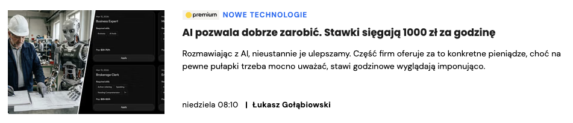
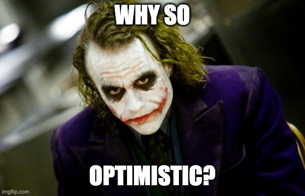

<!-- .slide: class="title-slide" data-state="center" -->

# The Answer to AI, Software Engineering, and Everything

---

<!-- .slide: class="title-slide" data-state="center" -->

## Mateusz Jarzębowski-Bownik

Software Engineer @ Box

---

<!-- .slide: data-background-image="assets/me-then-vs-me-now.jpg" data-background-size="contain" data-state="center" -->

---

<!-- .slide: data-background-image="assets/gmsd.png" data-background-size="contain" data-state="center" -->

---

<!-- .slide: data-background-image="assets/deep-thought.png" data-background-size="contain" data-state="center" -->

---

<!-- .slide: data-background-video="assets/hoping-nobody-will-have-to-debug-this-later.mp4" data-background-video-loop data-background-video-muted data-background-size="contain" data-state="center" -->

---

<!-- .slide: data-background-image="assets/claude-voldemort.jpg" data-background-size="contain" data-state="center" -->

---

  
  
  

---

<!-- .slide: data-background-image="assets/leslie-nielsen-nothing-to-see-here.gif" data-background-size="contain" data-state="center" -->

---

<!-- .slide: data-background-image="assets/superforcasting.jpg" data-background-size="contain" data-state="center" -->

---

<!-- .slide: data-background-image="assets/rust.png" data-background-size="contain" data-state="center" -->

---

<!-- .slide: data-background-image="assets/the-unpredictable.png" data-background-size="contain" data-state="center" -->

---

<!-- .slide: data-background-image="assets/jobs-poland.png" data-background-size="contain" data-state="center" -->

---

<!-- .slide: data-background-image="assets/april-2026-poland.png" data-background-size="contain" data-state="center" -->

---

<!-- .slide: data-background-image="assets/jobs-us.jpeg" data-background-size="contain" data-state="center" data-footnote-text="Source: Lenny Rachitsky" data-footnote-link="https://www.linkedin.com/feed/update/urn:li:activity:7442599442274291712/" -->

---

<!-- .slide: data-background-image="assets/jobs-bpos.jpeg" data-background-size="contain" data-state="center" data-footnote-text="Source: Jakub Jeziorny" data-footnote-link="https://www.linkedin.com/posts/jakubjeziorny_zatrudnienie-w-bposach-raczej-ro%C5%9Bnie-zamiast-share-7429863481580920832-tdU_/" -->

---

<!-- .slide: data-background-image="assets/996.png" data-background-size="contain" data-state="center" data-footnote-text="Source: LinkedIn post" data-footnote-link="https://media.licdn.com/dms/image/v2/D5622AQH2Nolx3hjF8w/feedshare-image-high-res/B56Z3bei_uI8AU-/0/1777503711471" -->

---

<!-- .slide: data-background-image="assets/comp-2026.jpeg" data-background-size="contain" data-state="center" data-footnote-text="Source: The Pragmatic Engineer" data-footnote-link="https://newsletter.pragmaticengineer.com/p/trimodal" -->

---

<!-- .slide: data-background-image="assets/devops.jpg" data-background-size="contain" data-state="center" -->

---

<!-- .slide: data-background-image="assets/kanalizacja.png" data-background-size="contain" data-state="center" data-footnote-text="Full brochure" data-footnote-link="https://polona.pl/preview/cb305681-623e-4b39-8d31-3bbb19b41989" -->

---

<!-- .slide: data-background-image="assets/overthinking.jpg" data-background-size="contain" data-state="center" -->

---

<!-- .slide: data-background-image="assets/plato.png" data-background-size="contain" data-state="center" -->

---

<!-- .slide: data-background-image="assets/factfulness.jpg" data-background-size="contain" data-state="center" -->

---

<!-- .slide: data-background-image="assets/dodo.jpeg" data-background-size="contain" data-state="center" -->

---

<!-- .slide: data-background-image="assets/dodo.jpeg" data-background-size="contain" data-state="center" data-background-opacity="0.35" -->

> "American programmers will share the fate of the dodo bird."

<small class="source">Ed Yourdon, 1992</small>
<small class="source">Influential software‑engineering methodologist</small>
<small class="source">Author of 20+ books</small>
<small class="source">Computer Hall of Fame inductee</small>
<small class="source"><a href="https://dl.acm.org/doi/pdf/10.1145/379300.379309">Source</a></small>

---

<!-- .slide: data-background-image="assets/thinking-fast-and-slow.jpg" data-background-size="contain" data-state="center" -->

---

## (just a few of) IT doomsday predictions

- Offshoring <!-- .element: class="fragment" -->
- From COBOL and 4GLs to CASE <!-- .element: class="fragment" -->
- Y2K <!-- .element: class="fragment" -->
- Dreamweaver <!-- .element: class="fragment" -->
- WordPress <!-- .element: class="fragment" -->
- Low-code / no-code <!-- .element: class="fragment" -->

---

<!-- .slide: data-background-image="assets/facebook-groups.jpg" data-background-size="contain" data-state="center" -->

---

  

  

  

- Skill erosion
- Systems instability
- Designers and UXers

  

---

## What's actually going to (most likely) happen?

---

<!-- .slide: data-background-image="assets/productivity-boom.png" data-background-size="contain" data-state="center" -->

---

<!-- .slide: data-background-image="assets/jevons-paradox.jpg" data-background-size="contain" data-state="center" data-footnote-text="Source" data-footnote-link="https://www.growthwaves.com/" -->

---

## Your profession is going to change

The question is, will you really notice that? <!-- .element: class="fragment" -->

---

## What can YOU do?

---

## Master the fundamentals

The cheap option:

  <figure>

  <figcaption><a href="https://youtu.be/bL1PYhogwp0">Quickstart</a> (free)</figcaption>
  </figure>
  <figure>

  <figcaption><a href="https://www.skool.com/agentic-labs/classroom/159a6570">Full course</a> (~$7)</figcaption>
  </figure>
  <figure>

  </figure>

---

## Master the fundamentals

The really good options:

  <figure>

  <figcaption><a href="https://www.10xdevs.pl/">10xDevs</a></figcaption>
  </figure>
  <figure>

  <figcaption><a href="https://www.aidevs.pl/">AI_Devs</a></figcaption>
  </figure>
  <figure>

  <figcaption><a href="https://developerjutra.pl/">Developer Jutra</a></figcaption>
  </figure>
  <figure>

  </figure>

---

## You will achieve:

- More strategic tasks <!-- .element: class="fragment" -->
- Larger diffs <!-- .element: class="fragment" -->
- Become an AI leader in your organization <!-- .element: class="fragment" -->
- Instinctively know the use-cases (and anti-use-cases for AI) <!-- .element: class="fragment" -->
- Prove impact and initiative to your manager <!-- .element: class="fragment" -->

---

<!-- .slide: data-background-image="assets/automation.jpg" data-background-size="contain" data-state="center" -->

---

## You will make mistakes

Refine as you go.

---

## Do not immediately jump to any new tool or model

<!-- .element: style="max-height: 50vh" -->

---

## Focus on building

Come back once there's enough signal that it's worth it

<!-- .element: style="max-height: 50vh" -->

---

## My current picks

- Opus-4.7-xhigh (for brainstorming) <!-- .element: class="fragment" -->
- GPT-5.5-high (for implementation) <!-- .element: class="fragment" -->
- Codex-5.3-spark (for QQs) <!-- .element: class="fragment" -->

---

## Do you:

- **Not use AI** (and finish in *~5 days*)?
- **Use AI proficiently** but review everything (*~3 days*)?
- Go **full-velocity** (*~1 day*)?

---

<!-- .slide: data-background-image="assets/swe.jpg" data-background-size="contain" data-state="center" data-background-opacity="0.15" -->

> "Generally trying to be 2x engineer, instead of 10x shipping s**t."

<small class="source">A very proficient Box software engineer</small>

---

## Internal knowledge sharing

- Open a slack channel <!-- .element: class="fragment" -->
- Do tech talks <!-- .element: class="fragment" -->
- Create a prompt library <!-- .element: class="fragment" -->

This is how you get ahead <!-- .element: class="fragment" -->

---

## Go work at a company which embraces AI

and there is top-down support for it

(if you can do it)

---

<!-- .slide: class="title-slide" data-state="center" -->

# Don't Panic

### Thanks!

Questions?

<!-- 

Missing slides:
- What if I'm wrong?
- 

-->